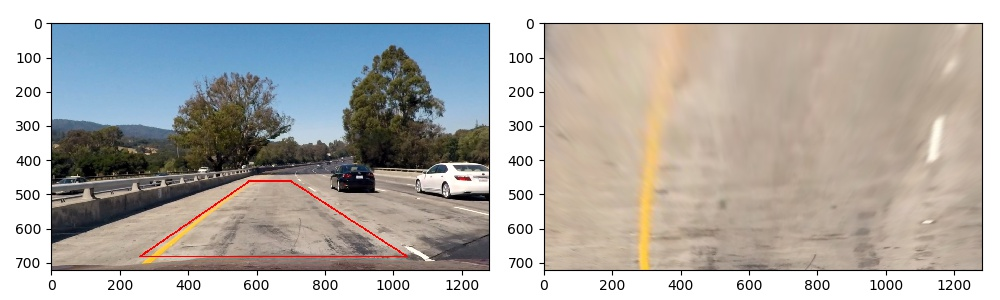
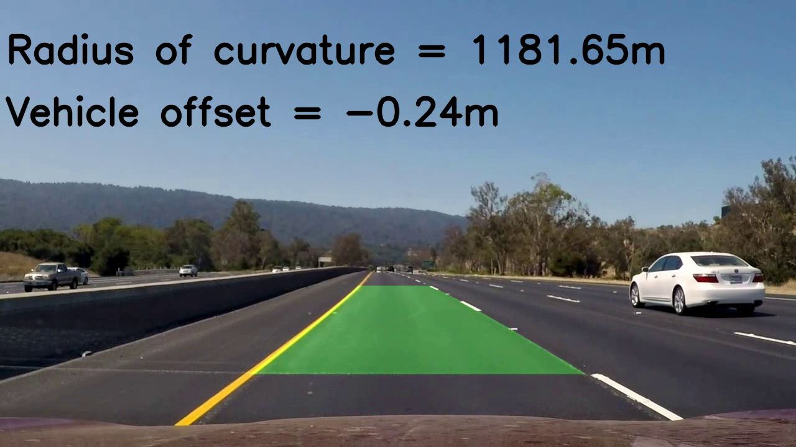
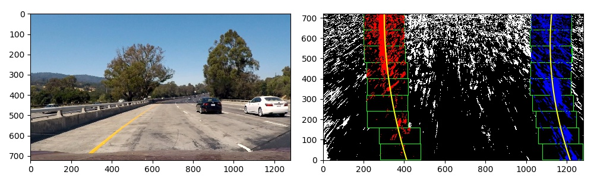
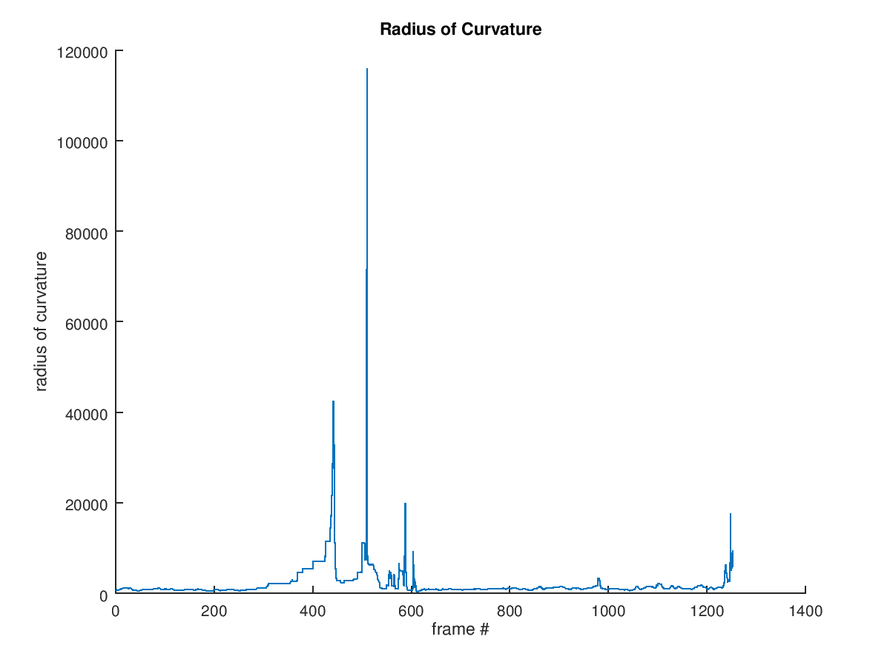
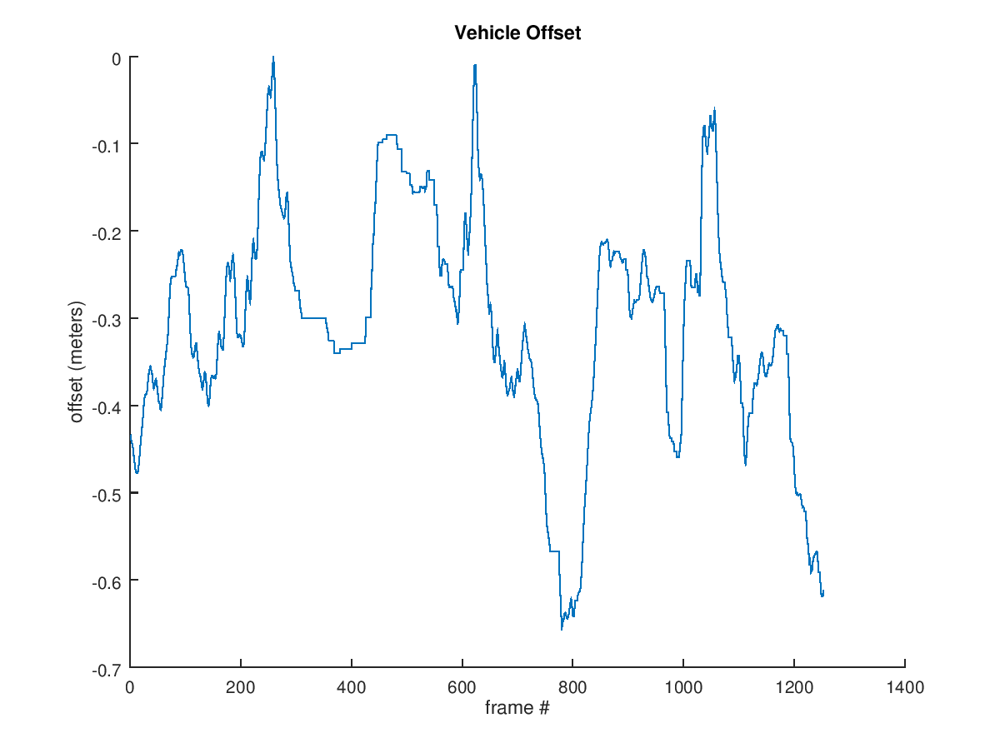
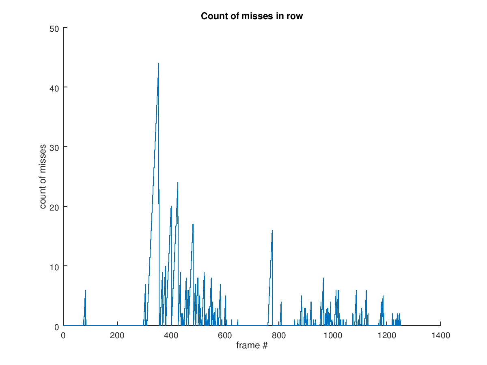

# Udacity SDC Advanced Lane Line Detection

# Input data

`project_video.mp4` was used as input data for `pipeline.py`.

# Output data

The processed video can be found in `output.avi`.

# Calibration

`calibrate.py` script creates a file with camera settings:

    python calibrate.py --chessboards camera_cal --rows 6 --cols 9 --output camera.pickle

`cv2.findChessboardCorners` was used to build a camera model. 

`camera.pickle` is a `pickle` file with a Python dictionary.

# Undistort

`undistort.py` uses `camera.pickle` (which is the output of `calibrate.py`) and an input image and outputs the undistorted image. 
  
    python undistort.py --camera camera.pickle --input camera_cal/calibration19.jpg --output output_images/undistorted.jpg
    
A sample of `undistory.py`'s work could be found here
  * `output_images/undistorted.jpg`.
  * `output_images/test1_undistorted.jpg`.

# Perspective transformation

Unwrapping is implemented in `alld.perspective`. 4 points that were used to build the transform matrix could be found below:

| Source        | Destination   | 
|:-------------:|:-------------:| 
| 580, 460      | 260, 0        | 
| 700, 460      | 1040, 0       |
| 1040, 680     | 1040, 780     |
| 260, 680      | 260, 780      |

These points were chosen to achieve the result of the lane lines in the unwrapped image being roughly parallel:

  

# Thresholds

The following filters were used to build a binary image:

  * HLS filter
  * Absolute Sobel X and Y
  * Direction Sobel
  
Thresholding is implemented in `alld.thresholds` package.

`Low` and `High` values were chosen experimentally. The output of each filter could be found in  `output_images/color` è `output_images/thresholds`.

The resulting binary image was built using the following formula:

    select_yellow = (binaries['yellow_s'] == 1) & (binaries['yellow_h'] == 1)
    select_white = binaries['white_l'] == 1
    select_sobel = (binaries['sobelx'] == 1) | (binaries['mag'] == 1) & (binaries['dir'] == 1)

    # combine
    bin = numpy.zeros_like(binaries['sobelx'])
    bin[select_sobel | select_yellow | select_white] = 1

That code selects `yellow` pixels, `white` pixels, and pixels with reasonable value of gradient.

## Pipeline

The final (but not the best) pipeline is implemented in `pipeline.py`.

The pipeline includes

  * binarization
  * lane lines finding
  * sanity check
  * smoothing
  * output (lane line, radius of curvature (see `alld.polynom2.Polynom2.curvature`), and vehicle offset (see `pipeline.Pipeline.process`))
 
NOTE: radius of curvature and vehicle offset are drawn in meters (see `alld.pixelspace` module).
 
This is an example of the frame from the output video:

  
 
### Sliding Window

The pipeline uses the `sliding window` algorithm to find the position of the lane line:

   

### Sanity Checks

As it was mentioned earlier, the pipeline finds lane lines using `sliding window` (or `margin-search` algorithm). These lines are considered to be `candidates`. Each candidate undergoes the `sanity check` (see `pipeline.Pipeline._sanity_check` function).

I didn't dedicate much time to the choice of the best sanity checks. I use

  * radius of curvature of the left and right line should be roughly the same (+- 1000 m)
  * lane width should be adequate: 3.7 m +- 1 m

## Metrics

Additional metrics was collected in order to estimate the level of "badness" of the pipeline. 

`pipeline.py` outputs metrics as the `metrics.mat` file. GNU Octave can be used to read metrics (just `load metrics`).

Metrics:

  
  
  
  
  

## Discussion

This project is driving me mad:

  * I really don't understand how to choose `low` and `high` thresholds 
  * It is really challenging to control the quality of the pipeline. I had to collect such metrics as radius of curvature for each frame, lane width, etc. However, it still unclear ...
  * In fact, the current pipeline works only for `project_video.mp4`. A lot of time is required to tune parameters for better performance for all the possible cases.
  
## Ideas

I think it would be potentially beneficial to analyze metrics. In addition, `sanity checks` should be improved.
